# WriteUP

**Convert text into perfectly realistic, handwritten page(s).**

Paste any text, pick a photo of paper (or upload your own), choose or *teach* a
handwriting style — WriteUP finds the page in the photo with computer vision,
lays out your text with real handwriting physics, and blends the ink into the
paper's perspective, lighting and grain.

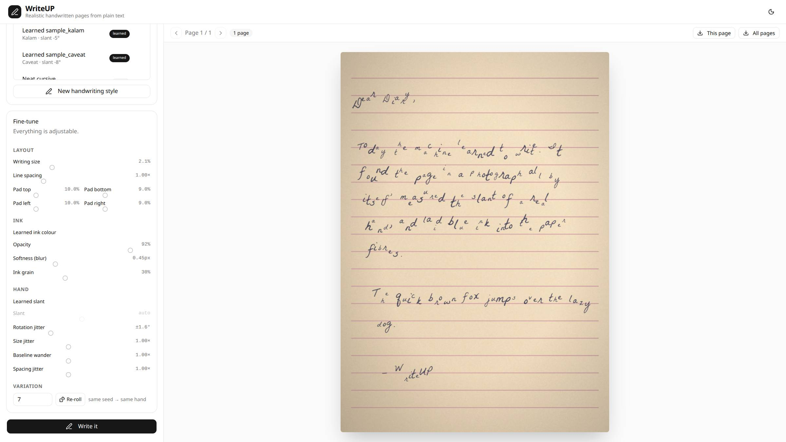

## Why it looks real

| Step | What happens |
|---|---|
| **Page detection** | OpenCV finds the paper quadrilateral in any photo — desk background, tilt, shadows — and computes the perspective homography. |
| **Style learning** | A photo of real handwriting is measured: ink colour, slant, glyph size, line spacing, baseline wander, size variance, character/word spacing. |
| **Per-glyph rendering** | Every character is drawn individually with random rotation, scale, baseline offset and spacing jitter sampled from the learned style. |
| **Perspective blend** | Ink is warped back into the photo and multiply-composited, so it darkens the paper fibres like a real pen — over ruled lines, stains, anything. |
| **Grain & softness** | Per-pixel alpha noise and micro-blur mimic ink soaking into paper. |

## Demo

**Video:** [assets/demo/writeup_demo.mp4](assets/demo/writeup_demo.mp4) — paste text → pick paper → pick style → handwritten page.

| Page found by CV | Handwritten result |
|---|---|
| 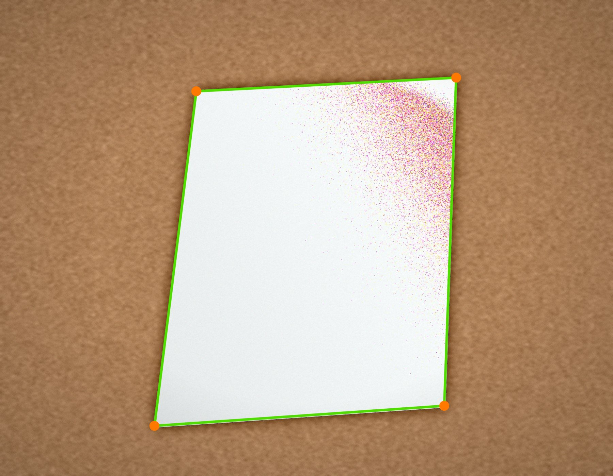 | 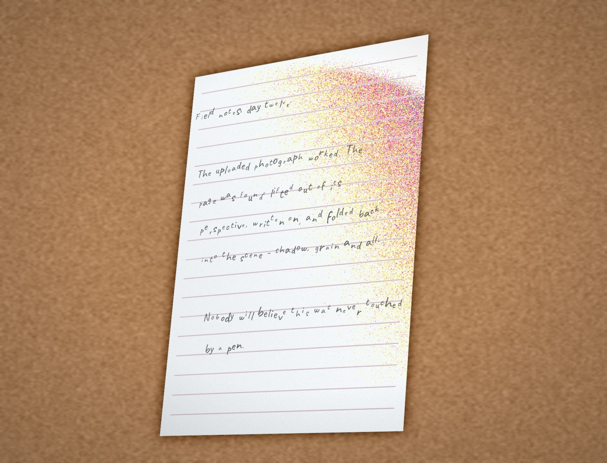 |

| Learned style on ruled paper | Cursive on a dark desk |
|---|---|
| 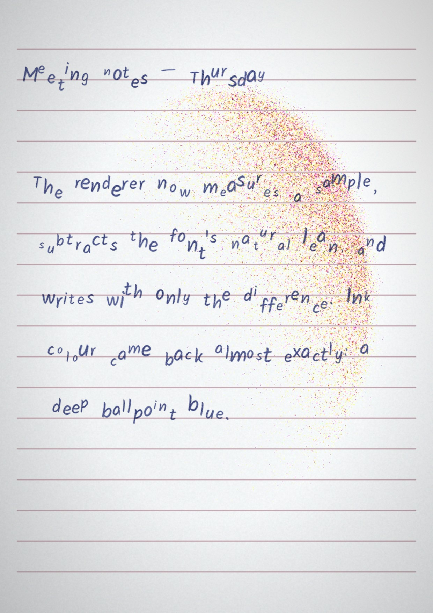 | 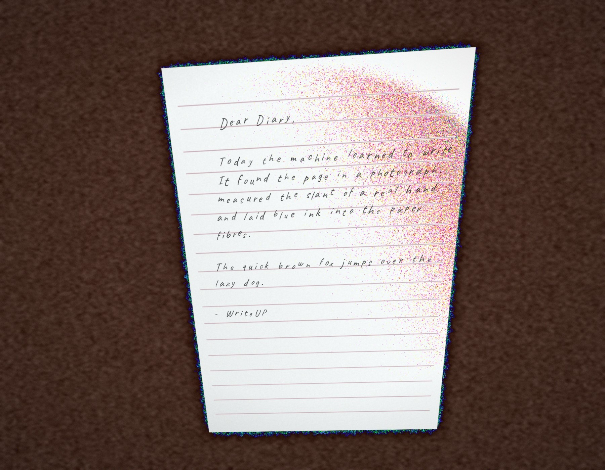 |

| Multi-page: page 1 (ruled) | Multi-page: page 3 (desk photo) |
|---|---|
| 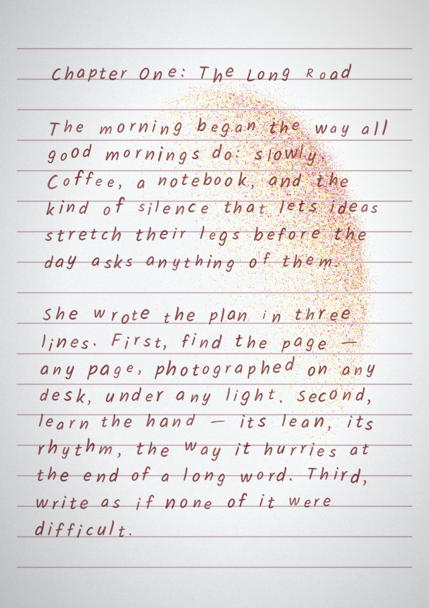 | 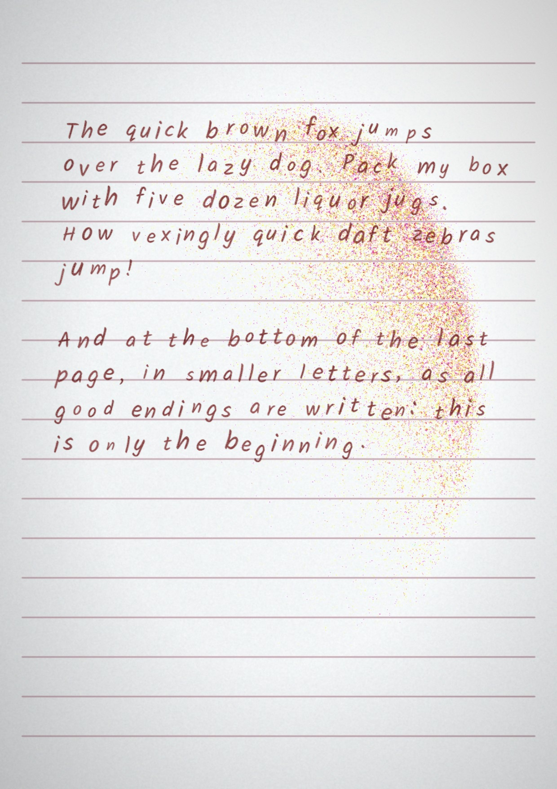 |

Dark mode UI:

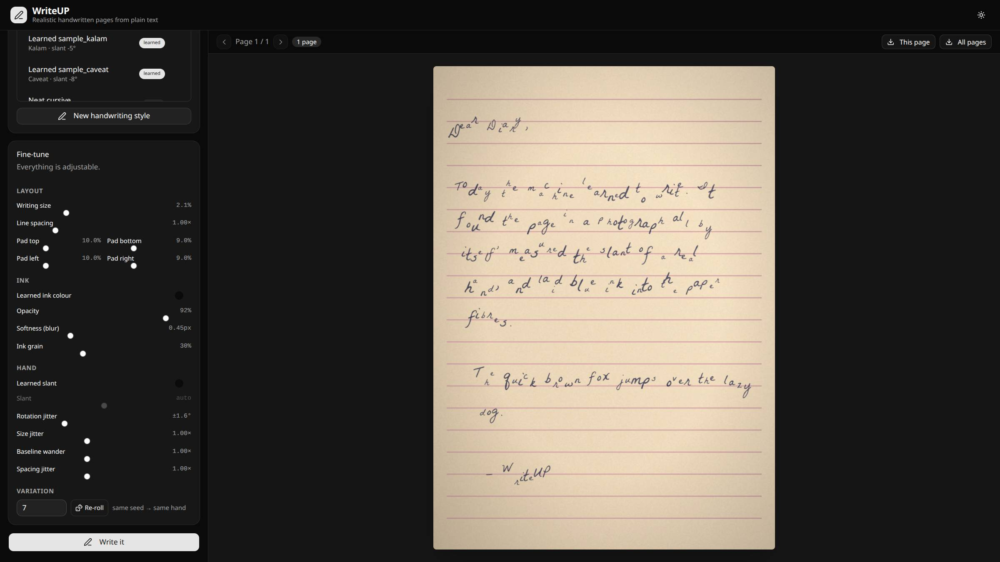

## Real-world validation

Tested with **real handwritten-paper photos from the web** (CC-licensed, via
Openverse/Flickr) — not synthetic stand-ins. The CV finds the page on
cluttered desks, learns ink colour and slant from real handwriting (including
a left-leaning pencil hand and right-leaning cursive), and writes back onto
the photographed pages in perspective.

| Detection: notepad on a cluttered desk | Detection: open café notebook |
|---|---|
| 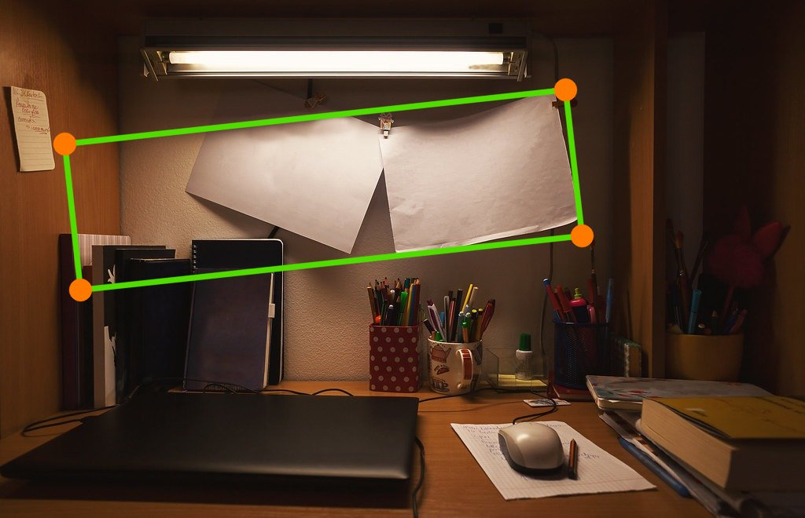 | 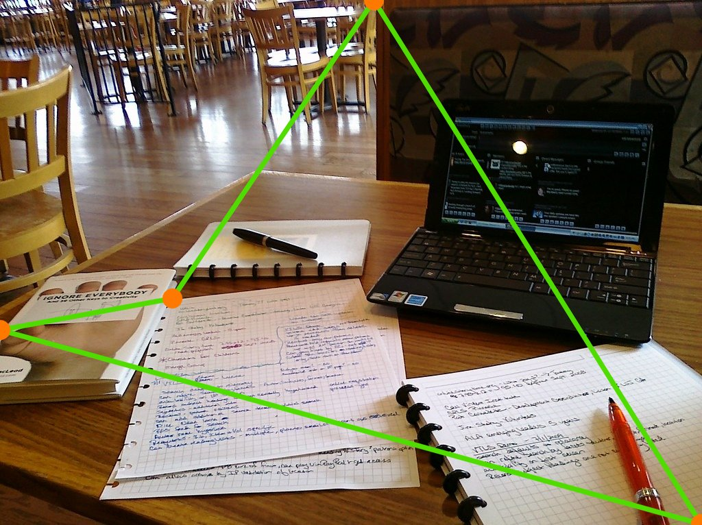 |

| Learned from a real letter → written on the desk pad | Learned pencil hand → café notebook |
|---|---|
| 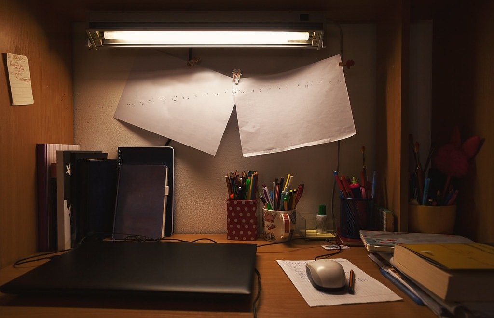 | 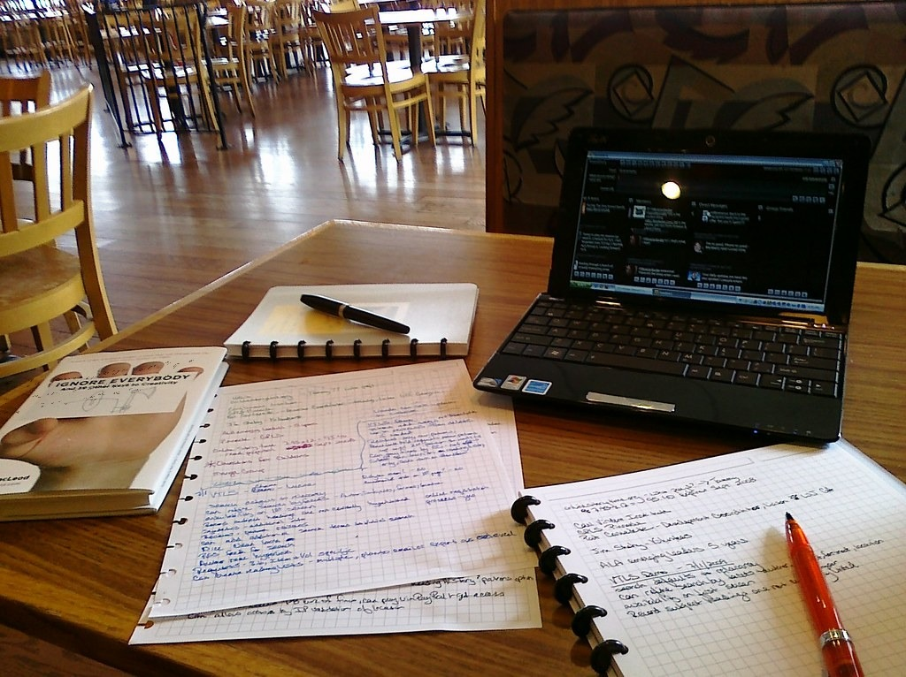 |

| Real cursive sample → card on a desk | Learned-from-real vs synthetic style |
|---|---|
| 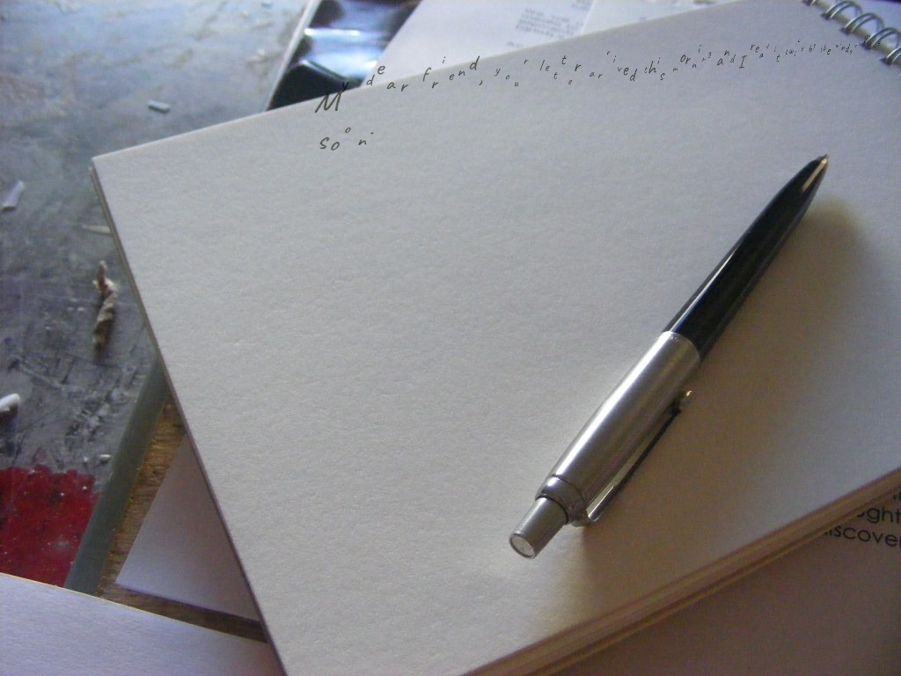 | 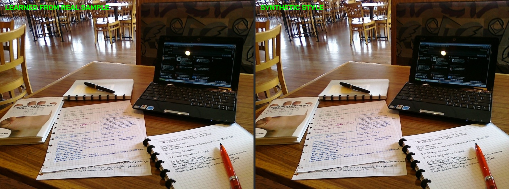 |

## Features

- **Paste text in** — automatic word-wrap and pagination across as many pages as needed.
- **Paper images** — built-in gallery (plain/ruled/graph, full-frame or on a desk) plus your own uploads; the page does *not* need to be empty.
- **Per-page papers** — assign images to pages in order; the selection repeats if text needs more pages.
- **Learn handwriting from a sample photo** — or start from one of 12 bundled OFL handwriting fonts.
- **Everything adjustable** — writing size, line spacing, 4-side padding, ink colour, slant, four kinds of jitter, opacity, blur, grain, and a variation seed (same seed → same hand).
- **Text scales with the page** — sizes are relative to page height, so one setting fits any photo resolution.
- **History** — every render is stored in SQLite; reload any past render's full settings.
- **Light & dark themes**, shadcn-svelte UI.

## Quick start

```bash
./setup.sh   # python venv + deps, fonts, frontend deps, sample data
./run.sh     # API on :8000, UI on http://localhost:5173
```

Requirements: Python 3.11+, Node 20+.

## Project layout

```
backend/app/      FastAPI API, CV page detection, style learner, renderer
frontend/         Svelte 5 + Vite + Tailwind 4 + shadcn-svelte
data/             SQLite db + papers/ samples/ fonts/ outputs/ thumbs/
scripts/          Font fetcher, sample generator, pipeline verifier
docs/             Development log & functionality docs
assets/demo/      Demo screenshots used in this README
```

## API sketch

```
GET  /api/papers                 POST /api/papers (upload)     DELETE /api/papers/{id}
GET  /api/styles                 POST /api/styles/from-sample  POST /api/styles/from-font
POST /api/render                 GET  /api/renders             GET  /api/files/{kind}/{name}
```

All validation and clamping happens at the API level — the UI is only a view.

## Verifying the pipeline

```bash
.venv/bin/python scripts/verify_containment.py
```

Renders bright-red ink onto desk photos and asserts every pixel lands inside
the detected page quad, plus pagination and robustness checks.

## License

MIT. Bundled fonts are OFL-licensed (Google Fonts).
